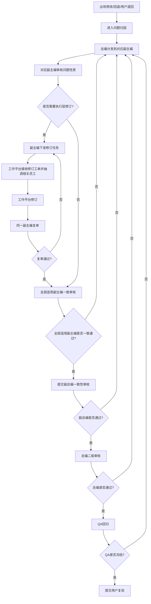

# 19-approved-production-flow

读取时机：任何生产、修复、回退、审稿、QA冻结、用户退回回归、Style Frame生成、HTML/PPT/PDF/截图包创建前必须读取。本文件是当前Skill内强制流程图，其他reference只能追加细节，不能绕过本流程。若用户最新要求修订本流程，先更新本文件或记录差异，再进入生产。

## 用户审核状态

- 初版流程图：当前Skill强制执行版本。
- 修改/回退补充分支：当前Skill强制执行版本。
- 历史“拟同意”措辞不得用于降低门槛；如用户最新要求冲突，以《用户最新要求锁定表》优先。

## 总流程图

```mermaid
flowchart TD
    A["用户提出生产/修复/审稿/继续下一版"] --> B{"是否为用户退回/质疑流程/质疑审美?"}

    B -- "是" --> C["进入 FAILED_VISUAL_FREEZE"]
    C --> C1["禁止继续生成 HTML/PPT/PDF/截图包"]
    C1 --> C1A["产物冻结锁：旧产物证据化，禁止复制/派生/截图验证"]
    C1A --> C2["失败审计：承认上一版状态"]
    C2 --> C3["旧版否决：列不可继承项"]
    C3 --> C4["Skill/流程门禁修订"]
    C4 --> C4A["附恢复材料：失败审计/旧版否决/门禁修订/subagent复核计划"]
    C4A --> C5["提交恢复生产申请"]
    C5 --> D{"用户是否明确同意恢复生产或Style Frame探索?"}
    D -- "否" --> Z1["仅交付失败审计/流程图/Page Spec，不生产"]
    D -- "仅同意Style Frame探索" --> C6["受控局部视觉证据：1-3页，不命名Vx，不扩展全稿"]
    C6 --> C5
    D -- "明确同意全稿生产" --> E["重新进入正式生产流程"]

    B -- "否" --> E["正式生产流程"]

    E --> F["读取 00-production-gate 与本流程图"]
    F --> J0["用户最新要求锁 + 历史需求整合(如适用)"]
    J0 --> G["建立团队协作记录"]
    G --> H["创建真实 subagent 编制与中文名称"]
    H --> H1{"subagent 是否可用?"}
    H1 -- "否" --> H2["记录 SUBAGENT-BLOCKER"]
    H2 --> Z2["阻断，不生产"]
    H1 -- "是" --> I["各副主编组织部门会议"]
    I --> I1["每部门1-2名员工参与并达成内部一致"]
    I1 --> I2{"部门会议是否全部有效?"}
    I2 -- "否" --> Z2
    I2 -- "是" --> J["交付文件初始备忘录"]

    I --> I0["阶段A：初始方向Skill栈调用 + 内部审美策略吸收"]
    I0 --> J0["用户最新要求锁 + 历史需求整合(如适用)"]
    J0 --> J["内容深挖"]
    J --> J1["页数充分性判断：增/删/拆/合/附录/讲者备注"]
    J1 --> J2["页面族谱 + 逐页Page Spec"]
    J2 --> K["参考库检索 + 趋势适用性判定"]
    K --> L0["模板/设计引擎适配性审查"]
    L0 --> L1["模板改造差异表：保留/改写/新增/删除/调整"]
    L1 --> L["Skill 调用决策"]
    L --> M["内容到 UI/动效转译"]
    M --> M1["首态/后续态矩阵：初始态/触发态/完成态"]
    M1 --> N["Style Frame 候选，不少于 2 个方向"]
    N --> O["调色板语义表 + 视觉舒适度检查"]
    O --> P["工作平台关键页试生产"]
    P --> P1["抽调各适用部门至少1名员工，填写关键页平台编制表"]
    P1 --> P2{"关键页工作平台是否就绪?"}
    P2 -- "否" --> P3["记录 PROCESS_BLOCKED_NO_WORK_PLATFORM"]
    P3 --> Z2
    P2 -- "是" --> P4["仅生产关键页/关键片段，不得生产全稿"]

    P4 --> P5["各副主编关键页初审"]
    P5 --> P6{"任一副主编退回?"}
    P6 -- "是" --> P7["工作平台修复关键页"]
    P7 --> P8["回到同一副主编复审"]
    P8 --> P5
    P6 -- "否" --> P9["全部副主编一致同意可交总编初审"]
    P9 --> P10{"总编是否同意正式生产?"}
    P10 -- "否" --> P7
    P10 -- "是" --> Q00["阶段B：正式生产平台Skill二次调用/复核"]
    Q00 --> Q0["正式全稿制作工单"]
    Q0 --> Q1["工作平台正式生产：各适用部门员工均须参与"]
    Q1 --> Q2{"正式生产工作平台是否就绪?"}
    Q2 -- "否" --> P3
    Q2 -- "是" --> Q["工作平台生成真实全稿产物"]

    Q --> S["实现后一级复核"]
    S --> S1["同一批 subagent 检查真实文件、源码和工作平台证据"]
    S1 --> T{"任一副主编退回?"}

    T -- "是" --> U["工作平台修复"]
    U --> V["回到同一副主编复审"]
    V --> T

    T -- "否" --> T1["全部适用副主编一致审核"]
    T1 --> T2{"是否一致通过?"}
    T2 -- "否" --> U
    T2 -- "是" --> T3["副总编一致性审核"]
    T3 --> T4{"副总编是否通过?"}
    T4 -- "否" --> U
    T4 -- "是" --> W["总编二级复核"]
    W --> X{"总编是否退回?"}
    X -- "是" --> U
    X -- "否" --> R["工程烟测：交互/截图非空/溢出；不得替代审美QA"]
    R --> Y["QA 冻结"]

    Y --> Y1["contact sheet 缩略图总览"]
    Y1 --> Y2["重点页放大人工审美复核"]
    Y2 --> Y3["视觉舒适/光学平衡/分步状态/动效美感/调色板/参考落地/Skill落地核验"]
    Y3 --> AA{"QA 是否冻结?"}

    AA -- "否" --> C
    AA -- "是" --> AB["候选交付/冻结待验收"]
    AB --> AC["提交用户验收"]
    AC --> AD{"用户是否通过?"}

    AD -- "否" --> C
    AD -- "是" --> AE["正式交付完成"]
```

## 修改/回退流程图

任何修改、回退、用户退回、审美不满意、流程质疑、QA阻断或局部页面修订，都不得由主Agent直接修改后继续交付。必须进入以下闭环：

## 强制执行规则

1. `FAILED_VISUAL_FREEZE`后，不能继续生成下一版全稿。
1a. `FAILED_VISUAL_FREEZE`后，旧HTML/PPT/PDF/截图包/样张目录只能作为失败证据读取和盘点；不得复制为新Vx、修改、重命名为候选稿、导出新截图、跑Playwright或生成validation。
1b. 恢复生产申请必须附失败审计、旧版否决、Skill/流程门禁修订、真实subagent复核计划和用户最新要求锁；用户只说“继续优化/再来一版/可以改”，不构成恢复授权。
1c. 用户仅批准Style Frame探索时，只能生成受控局部视觉证据；不得命名Vx、不得扩展全稿、不得称QA冻结或交付。
2. 预审、Style Frame建议、主线程自查，都不能算实现后复核。
3. 修改/回退也必须由总编分发到对应副主编，执行层只按副主编工单修订。
3a. 任何制作或修订工单都必须进入工作平台；未启用工作平台、缺少跨部门员工或缺少文件所有权映射时，写`PROCESS_BLOCKED_NO_WORK_PLATFORM`并停止。
3b. 正式生产前必须先完成各部门会议和《交付文件初始备忘录》；每个部门必须有副主编和1-2名员工达成内部一致，且所有subagent/员工必须有职责化中文名称。
3c. 工作平台首次启用只能依据《交付文件初始备忘录》生产关键页/关键片段；缺少关键页试生产、全部副主编关键页初审/复审、总编初审同意时，不得生产全稿。
3d. 关键页试生产和正式全稿生产两个阶段的工作平台都必须覆盖每个适用部门至少一名员工；任一适用部门缺席且无副主编“不适用”签署时，状态为`PROCESS_BLOCKED_NO_WORK_PLATFORM`。
4. 谁退回，谁复审；但退回副主编同意只代表该问题点复审通过，不代表全局通过。
5. 修复后必须重新进入全部适用副主编一致审核；不得只由打回的那个副主编同意后直接交副总编、总编或QA。
6. 同一副主编subagent复审缺失、全部适用副主编一致审核缺失时，不得进入副总编、总编或QA。
7. 只有“实现后subagent复核 + 全部适用副主编一致审核 + 副总编一致性审核 + 总编二级复核 + QA冻结 + 用户验收”同时完成，才允许说正式交付。
8. 正式生产链路中的页数必须来自《页数充分性判断表》；旧版、样本或模板页数只能作为参考约束，不能自动成为最终页数。
9. 工程烟测中的页数检查只能证明实际页数与计划页数一致，不能证明计划页数充分。

## 状态口径

| 状态 | 允许动作 | 禁止动作 |
| :--- | :--- | :--- |
| `FAILED_VISUAL_FREEZE` | 失败审计、既有证据归档、旧版否决、流程修订、文字Page Spec或恢复生产申请 | 生成下一版全稿、复制旧版、创建Vx目录、导出新截图、运行validation、称为完成 |
| `PROCESS_BLOCKED_NO_WORK_PLATFORM` | 补工作平台编制、补交付记录、调整工单或回到部门一致意见 | 创建/修改产物、截图、validation、命名Vx、称为候选稿 |
| Style Frame探索期 | 在用户明确批准后，且`SEL-real`、制作工单、工作平台编制、文件所有权映射和`PROCESS_READY_WORK_PLATFORM`齐全时，生成1-3页局部视觉方向证据，供恢复生产决策 | 缺少subagent或工作平台证据时生成文件/截图、命名Vx、扩展全稿、跑冻结QA、称候选交付 |
| 关键页试生产期 | 工作平台按《交付文件初始备忘录》生成关键页/关键片段，供副主编和总编初审 | 扩展全稿、跳过任一适用部门员工、缺少副主编复审、总编未同意即正式生产 |
| 修改/回退闭环中 | 问题归因、副主编审核、工作平台修订、同一副主编复审、全部适用副主编一致审核 | 主Agent直接改完并宣布通过；只由打回副主编同意就继续 |
| 候选交付/冻结待验收 | 提交用户验收 | 称为正式交付 |
| 正式交付 | 用户验收通过后归档 | 无 |
